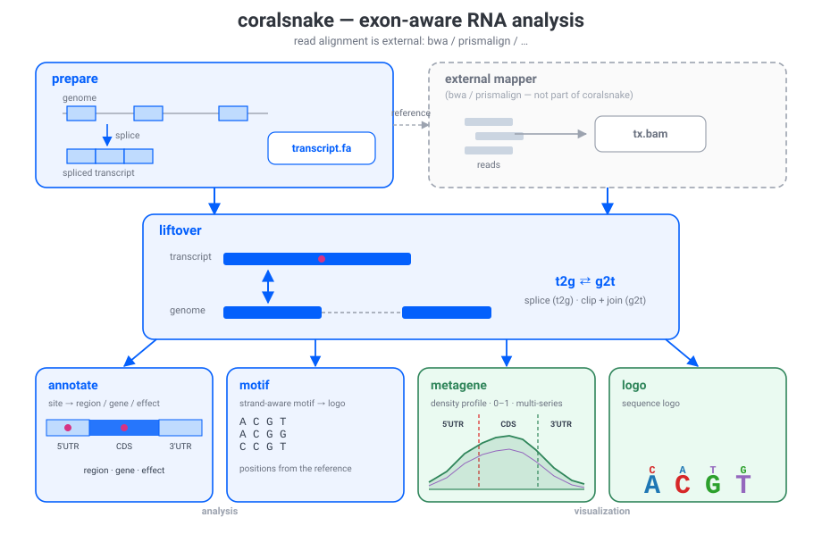

# Coralsnake


Conventional genomics tools are built around DNA — a linear, double-stranded
reference where each locus lines up 1:1 with the sequence — and often lack
explicit consideration of RNA's structural properties: an **abundance
hierarchy** (ribosomal rRNA is orders of magnitude more abundant than
mRNA), **strand orientation** (sense vs. antisense), and **splicing** (mRNAs
are assembled from exons, so a transcript does not line up with its genomic
locus). Coralsnake is an **exon-aware RNA analysis pipeline** built around
exactly these properties: it turns a GTF/GFF into spliced
transcript references (`prepare`), **splices and joins** reads between
transcript and genome coordinates in both
directions (`liftover`), and runs the analyses you do on the results —
**annotate** places sites/variants on the RNA hierarchy (5'UTR / CDS / 3'UTR /
intronic / intergenic) and calls the variant effect, **metagene** profiles how
sites distribute across 5'UTR / CDS / 3'UTR, **motif** fetches the strand-aware
reference motif around each site, and **logo** renders a DNA/RNA sequence logo.



## Installation

```bash
pip install coralsnake
```

The visualization commands (metagene plot, sequence logo) need the lightweight
`plot` extra, which only pulls in matplotlib when you need it:

```bash
pip install "coralsnake[plot]"
```

## Commands

| Command      | What it does                                                        |
| ------------ | ------------------------------------------------------------------- |
| `prepare`    | Extract the spliced primary transcript reference from GTF/GFF.      |
| `liftover`   | Splice/join reads between genome/transcript BAMs (`-d t2g` default, `-d g2t` inverts). |
| `annotate`   | Unified site/variant annotation: region on the RNA hierarchy + gene/transcript + variant effect. |
| `metagene`   | Exon-aware metagene profiling across 5'UTR/CDS/3'UTR (profile plot needs `coralsnake[plot]`). |
| `motif`      | Strand-aware genomic motif fetch around variant sites.              |
| `coordinate` | Map chromosome names between coordinate systems (UCSC↔Ensembl).    |
| `group`      | Group genes and build a consensus sequence.                         |
| `logo`       | Plot a DNA/RNA sequence logo (needs `coralsnake[plot]`).            |

> **`annotate` is the single annotation tool** — one command, one schema, two
> input modes: `--reference-gtf` (region + gene/transcript, and the full variant
> effect when given a genome FASTA + ref/alt) or `--annotation <table>` (fast
> precomputed-table site labeling).

## Quick example

A typical end-to-end run (read alignment is done by any external mapper, e.g.
`bwa` / `prismalign`):

```bash
# 1. Build the spliced transcript reference from the annotation
coralsnake prepare -g annotation.gtf -f genome.fa -o transcript.fa --with-txpos

# 2. Align reads to transcript.fa with an external mapper  →  tx.bam

# 3. Splice the transcript-aligned BAM back to genome coordinates
coralsnake liftover -d t2g -i tx.bam -o genome.bam -a annotation.tsv -f genome.fai

# 4. Annotate sites to genes/transcripts (RNA hierarchy + variant effect)
coralsnake annotate -i sites.tsv -o annotated.tsv \
                    --reference-gtf annotation.gtf \
                    --reference-transcript genome.fa -s -a

# 5. Exon-aware metagene profile across 5'UTR / CDS / 3'UTR
coralsnake metagene -i sites.tsv -g annotation.gtf -o profile.tsv -p profile.png
```

## Documentation

- [Architecture & Design](architecture.md) — how the package is organized.
- [CLI Reference](cli.md) — full usage of every subcommand.
- [Python API](api.md) — import the functions directly.
- [Metagene](metagene.md) — metagene profiling details.
- [Logo](logo.md) — sequence-logo plotting details.
- [Variant](variant.md) — genomic variant analysis subcommand group.

---

> **Mapping is out of scope.** Nucleotide-conversion (two-color / three-color)
> mapping is not part of coralsnake any more: it lives in the dedicated
> [`prismalign`](https://github.com/y9c/prismalign) package (pluggable backends:
> bwamem, minimap2/mappy, pure-Python), on top of the lightweight
> [`bwamem`](https://github.com/y9c/bwamem) BWA-MEM binding.
