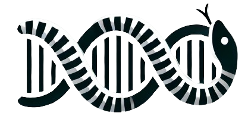

# Coralsnake



> Transcriptome mapping in two colors

Coralsnake is a transcriptome mapping toolkit with a two-color mapping
workflow and bundled **metagene** profiling and **sequence-logo** plotting.

## Installation

```bash
pip install coralsnake
```

Visualization commands (metagene plot, sequence logo) need the optional
`plot` extra:

```bash
pip install "coralsnake[plot]"
```

## Commands

| Command    | Description                                                       |
| ---------- | ----------------------------------------------------------------- |
| `prepare`  | Extract primary transcript from a GTF/GFF file.                   |
| `map`      | Map reads to a reference genome using BWA-MEM (two-color aware).  |
| `liftover` | Remap transcriptome-aligned reads back to genome coordinates.     |
| `annot`    | Annotate a TSV of genomic sites with transcript positions.        |
| `group`    | Group genes and build a consensus sequence.                       |
| `metagene` | Metagene profiling across 5'UTR/CDS/3'UTR.                        |
| `logo`     | Plot a DNA/RNA sequence logo.                                     |

See the [CLI reference]() for full usage or jump straight to
[metagene]() and [logo]().
