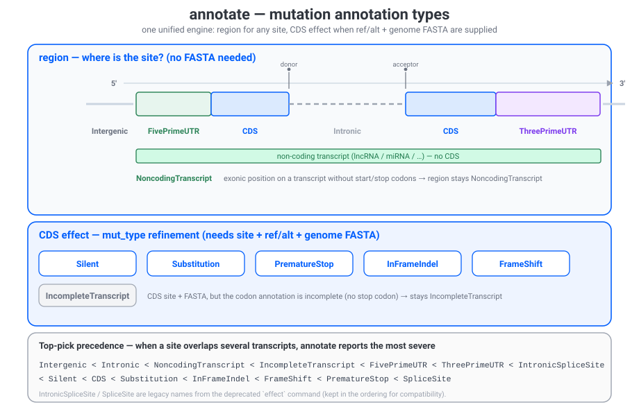

# Variant Analysis

Coralsnake provides two variant-analysis commands — `motif` and `coordinate` —
plus the unified `annotate` command for site/variant annotation. `motif` and
`coordinate` are a migration of the standalone
[`variant`](https://github.com/y9c/variant) toolkit with the same naming and
output format, but built on coralsnake's `pysam` + `ruranges` stack (the old
`pyfaidx` / `urllib3` dependencies are gone).

All of these commands read/write gzip and `-` (stdin/stdout) transparently.

## `motif`

Fetch a genomic motif centred on each site (strand-aware, padded with `N`).

```bash
coralsnake motif -i sites.tsv -o motifs.tsv -f genome.fa -n 2,3 -w -H
```

| Option | Description                                   |
| ------ | --------------------------------------------- |
| `-i, --input` | Input position file.                     |
| `-o, --output` | Output file.                            |
| `-f, --fasta` | Reference FASTA (**required**).           |
| `-n, --npad` | Padding bases; comma for left,right pads (`2,3`). |
| `-u, --to-upper` | Uppercase the motif.                   |
| `-w, --wrap-site` | Wrap the site in `[ ]`.                |
| `-H, --with-header` | Input has a header.                    |
| `-c, --columns` | Chrom,Pos,Strand columns (default `1,2,3`). |

## `coordinate`

Map chromosome names between reference coordinate systems (UCSC ↔ Ensembl,
custom, or built-in).

```bash
coralsnake coordinate -i sites.tsv -o mapped.tsv -m chrom_map.tsv -c 1
coralsnake coordinate -i sites.tsv -o mapped.tsv -M U2E
```

| Option | Description                                      |
| ------ | ------------------------------------------------ |
| `-m, --reference-mapping` | Custom 2-column mapping file.            |
| `-M, --buildin-mapping` | `U2E`, `E2U`, `U2E-hg38`, `E2U-hg38`, `U2E-mm39`, `E2U-mm39`. |
| `-c, --columns` | Chrom column (default `1`).                    |
| `-k, --keep-original` | Append the rename instead of replacing.   |
| `-H, --with-header` | Input has a header.                        |

## `annotate`

The unified site / variant annotation command — one GTF-based engine, one fixed
output schema. Use `annotate` for anything that falls under "which
gene/transcript is this, and what does it do?".

The same command serves a bare site (only chrom,pos,strand given ->
gene/transcript/position + region, no FASTA needed) **and** a full variant
(chrom,pos,strand,ref,alt + a genome FASTA -> coding codon/AA + effect).
Input positions are **1-based** (the package-wide site convention, shared with
`motif` and the metagene 3-column mode).

```bash
# site labeling (region + gene/transcript/position) - just a GTF
coralsnake annotate -i sites.tsv -o out.tsv --reference-gtf annotation.gtf -c 1,2,3

# variant effect - add a genome FASTA (+ ref/alt columns)
coralsnake annotate -i variants.tsv -o effects.tsv \
                    --reference-gtf annotation.gtf --reference-transcript genome.fa -s -a
```

| Option | Description                              |
| ------ | ---------------------------------------- |
| `-i, --input` | Input site/variant file (**1-based** positions, like `motif`). |
| `-o, --output` | Output annotation file.          |
| `-g, --reference-gtf` | Reference GTF (**required**).     |
| `-f, --reference-transcript` | Genome FASTA (needed for motif/codon/AA). |
| `-s, --strandness` | Use strand information (flip ref/alt for `-` sites). |
| `-a, --all-effects` | Output all overlapping effects (not just the top). |
| `-n, --npad` | Padding bases (default 10).       |
| `-H, --with-header` | Input has a header.            |
| `-c, --columns` | Chrom,Pos,Strand,Ref,Alt (default `1,2,3,4,5`; Ref/Alt optional). |

### Output columns (single fixed schema)

```
gene_id  transcript_id  transcript_pos  region  gene_pos  transcript_strand
mut_type  transcript_motif  coding_pos  codon_ref  aa_pos  aa_ref  distance2splice
```

`region` (Intergenic / Intronic / 5'UTR / CDS / 3'UTR / Noncoding) is always
filled. The `mut_*`/coding columns are filled only when a genome FASTA and
ref/alt were supplied; otherwise they are empty.

### Mutation annotation types

`annotate` emits one small fixed vocabulary, split across two columns — the
figure below maps every type onto where it applies:



**region** — always filled; the position relative to the containing transcript
(no FASTA needed):

| region | Meaning |
| ------ | ------- |
| Intergenic | Outside every annotated gene body. |
| Intronic | Inside a gene body but not in any exon. |
| NoncodingTranscript | Exonic, on a transcript with no start/stop codon (non-coding biotype). |
| FivePrimeUTR | Exonic, before the start codon. |
| CDS | Exonic, inside the coding sequence. |
| ThreePrimeUTR | Exonic, after the stop codon. |

**mut_type** — the region by default; refined for CDS sites when ref/alt **and**
a genome FASTA (`-f/--reference-transcript`) are supplied:

| mut_type | Meaning | Emitted when |
| -------- | ------- | ------------ |
| Silent | Codon change with no amino-acid change (synonymous). | CDS + ref/alt + FASTA |
| Substitution | Codon change altering the amino acid (missense, non-stop). | CDS + ref/alt + FASTA |
| ComplexSubstitution | Equal-length multi-base change (MNP). | CDS + ref/alt + FASTA |
| PrematureStop | Substitution introducing an in-frame stop codon. | CDS + ref/alt + FASTA |
| InFrameIndel | Net indel length is a multiple of three → frame kept. | CDS + ref/alt + FASTA |
| FrameShift | Net indel length not a multiple of three → frame shifted. | CDS + ref/alt + FASTA |
| IncompleteTranscript | CDS site on a transcript with incomplete codon annotation (e.g. no stop codon). | CDS + FASTA, incomplete transcript |

If several transcripts overlap one site, `annotate` reports the **most severe**
annotation by default (severity order shown at the bottom of the figure) and all
of them with `-a/--all-effects`. `IntronicSpliceSite` / `SpliceSite` are legacy
names kept in the severity order from the deprecated `effect` command.

## Python API

The commands are also importable functions.

```python
from coralsnake.annotate import run_annotate, Annotation  # unified
from coralsnake.motif import get_motif
from coralsnake.coordinate import run_coordinate
```
